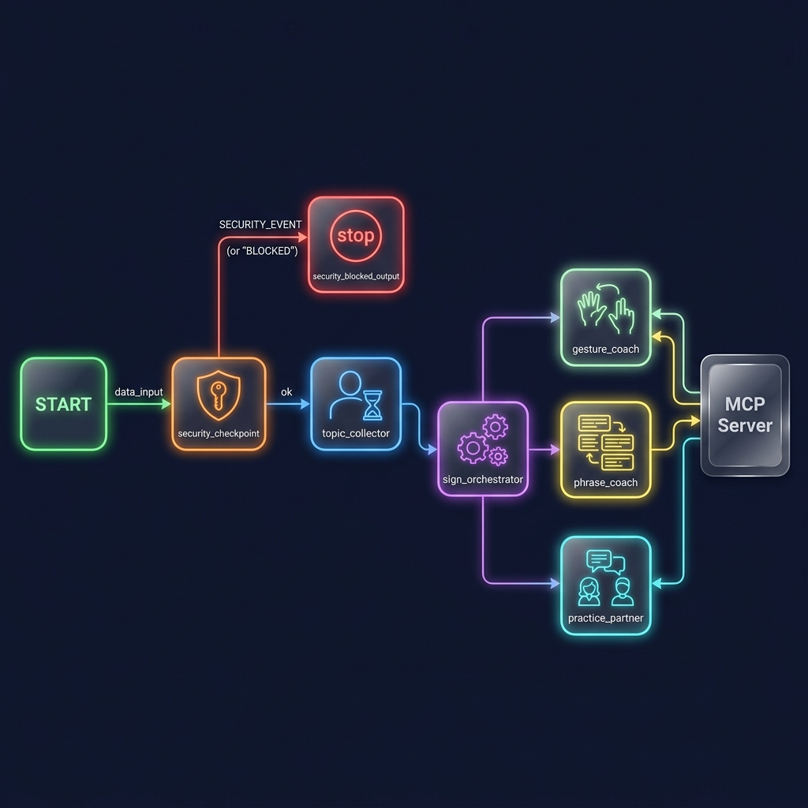
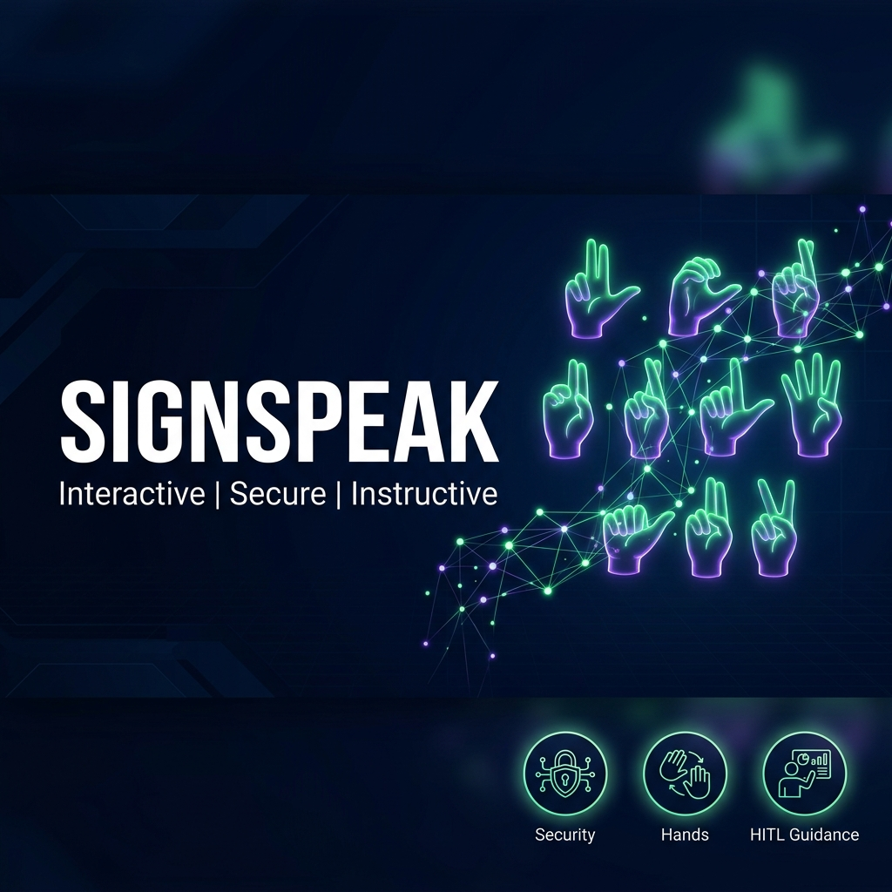

# SignSpeak — Interactive Sign Language and Fingerspelling Coach

SignSpeak is a secure, multi-agent AI tutor built on the Google Agents SDK (ADK) that helps users learn basic American Sign Language (ASL) gestures, fingerspelling, and vocabulary.

## Prerequisites

* Python 3.11+
* [uv](https://docs.astral.sh/uv/) (highly recommended Python package manager)
* Gemini API Key (obtained from [Google AI Studio](https://aistudio.google.com/apikey))

## Quick Start

```bash
# Clone the repository
git clone <repo-url>
cd sign-speak

# Set up environment variables
cp .env.example .env   # Or create a .env file and add your GOOGLE_API_KEY

# Install dependencies and sync virtual environment
make install

# Start the interactive local playground
make playground        # Opens the UI at http://localhost:18081
```

## Architecture Diagram

```mermaid
graph TD
    classDef security fill:#f96,stroke:#333,stroke-width:2px;
    classDef agent fill:#9cf,stroke:#333,stroke-width:2px;
    classDef hitl fill:#fcf,stroke:#333,stroke-width:2px;
    classDef mcp fill:#dfd,stroke:#333,stroke-width:2px;

    START --> SC[security_checkpoint]:::security
    SC -- "SECURITY_EVENT" --> SBO[security_blocked_output]:::security
    SC -- "ok" --> TC[topic_collector (HITL)]:::hitl
    TC --> SO[sign_orchestrator]:::agent
    
    SO --> |AgentTool| GC[gesture_coach]:::agent
    SO --> |AgentTool| PC[phrase_coach]:::agent
    SO --> |AgentTool| PP[practice_partner]:::agent
    
    MS[(MCP Server)]:::mcp
    GC <--> |Tools| MS
    PC <--> |Tools| MS
    PP <--> |Tools| MS
```

## How to Run

* **`make playground`** (Windows: `uv run adk web app --host 127.0.0.1 --port 18081 --reload_agents`)
  Starts the local development server and opens the web-based interactive workspace playground at http://localhost:18081.
* **`make run`**
  Starts the agent in CLI/production web mode.

## Sample Test Cases

### Test Case 1: Letter/Gesture Query
* **Input:** `"How do I sign the letter B?"`
* **Expected:** The request passes the security checkpoint, auto-detects the topic as **Gestures**, and routes to `gesture_coach`. The coach uses the `get_gesture_description` MCP tool to describe the hand shape.
* **Check:** You will see a detailed description of forming the letter 'B' (four fingers up, thumb tucked across palm) and a helpful mnemonic in the playground chat window.

### Test Case 2: Greeting/Phrase Query
* **Input:** `"Can you teach me how to sign thank you?"`
* **Expected:** The request passes the security checkpoint, auto-detects the topic as **Phrases**, and routes to `phrase_coach`. The coach uses the `sign_dictionary_search` MCP tool to fetch the sign details.
* **Check:** You will see step-by-step instructions on touching your chin and moving your hand outward, along with an explanation of the cultural context.

### Test Case 3: Practice Quiz Query
* **Input:** `"I want to practice my greetings skills. Give me a quiz."`
* **Expected:** The request passes the security checkpoint, auto-detects the topic as **Practice**, and routes to `practice_partner`. The partner uses the `practice_quiz` MCP tool to generate questions.
* **Check:** You will see a 3-question beginner greetings quiz with an answer key provided at the end.

## Troubleshooting

1. **`ERROR: [Errno 10048] address already in use`**
   * *Cause:* Another process is already running on port 18081.
   * *Fix:* Run the following command in PowerShell to kill the process holding the port:
     ```powershell
     Get-Process -Id (Get-NetTCPConnection -LocalPort 18081, 8090 -ErrorAction SilentlyContinue).OwningProcess | Stop-Process -Force
     ```
2. **`404 Model Not Found / Resource Exhausted`**
   * *Cause:* Using an unsupported/retired Gemini model or rate limits on AI Studio free tier.
   * *Fix:* Verify your `.env` file uses `GEMINI_MODEL=gemini-2.5-flash` or `gemini-2.5-flash-lite`.
3. **`ModuleNotFoundError / extra arguments on adk web`**
   * *Cause:* Running in a wrong directory or virtual environment mismatch.
   * *Fix:* Ensure you are inside the `sign-speak` directory, and run `uv sync` to rebuild the virtual environment.

## Push to GitHub

1. Create a new repo at https://github.com/new
   - Name: `sign-speak`
   - Visibility: Public or Private
   - Do NOT initialize with README (you already have one)

2. In your terminal, navigate into your project folder:
   ```bash
   cd sign-speak
   git init
   git add .
   git commit -m "Initial commit: sign-speak ADK agent"
   git branch -M main
   git remote add origin https://github.com/<your-username>/sign-speak.git
   git push -u origin main
   ```

3. Verify `.gitignore` includes:
   ```
   .env          ← your API key — must NEVER be pushed
   .venv/
   __pycache__/
   *.pyc
   .adk/
   ```

⚠️ NEVER push `.env` to GitHub. Your API key will be exposed publicly.

## Assets

* **Architecture Diagram:** 
* **Cover Page Banner:** 

## Demo Script

Refer to [DEMO_SCRIPT.txt](DEMO_SCRIPT.txt) for a complete spoken walkthrough script.
