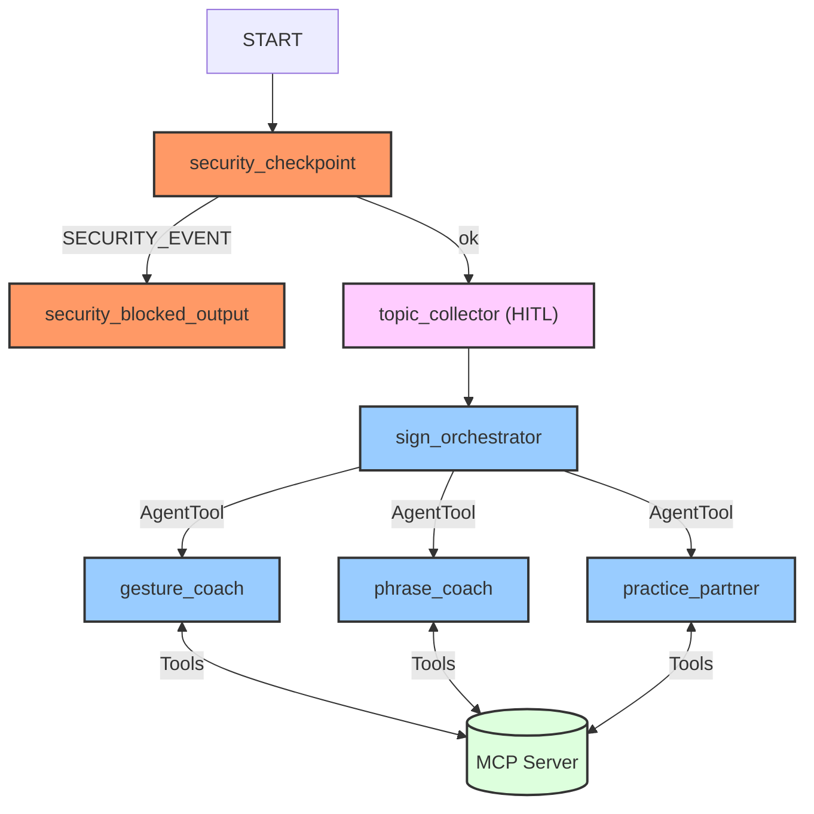

# SignSpeak Submission Write-Up

## Problem Statement
Learning sign language is essential for inclusive communication and supporting individuals who are deaf or hard-of-hearing. However, many learners struggle with finding interactive feedback, remembering static gestures (fingerspelling), and understanding the distinct grammatical structure of American Sign Language (ASL). SignSpeak addresses this gap by providing an interactive, structured, and secure AI-driven tutor that guides users through alphabet hand shapes, phrases, and grammar drills.

## Solution Architecture

## Concepts Used

1. **ADK Workflow:** Used to construct a structured execution graph of function nodes (`security_checkpoint`, `topic_collector`, `security_blocked_output`) and specialist agents (implemented in [agent.py](app/agent.py#L295-L305)).
2. **LlmAgent:** Employed to instantiate specialist coaches (`gesture_coach`, `phrase_coach`, `practice_partner`) and the main orchestrator (`sign_orchestrator`) in [agent.py](app/agent.py#L40-L100).
3. **AgentTool:** Wired into the orchestrator for dynamic sub-agent delegation in [agent.py](app/agent.py#L122-L126).
4. **MCP Server:** Exposes custom local tools for fetching sign descriptions, searching dictionary entries, generating mnemonics, and creating quizzes in [mcp_server.py](app/mcp_server.py).
5. **Security Checkpoint:** Implemented as a node to scan incoming text for PII leaks, prompt injection, and inappropriate content requests in [agent.py](app/agent.py#L133-L224).
6. **Agents CLI:** Scaffolding and running local agent testing via `adk web` in the playground.

## Security Design

* **PII Scrubbing:** Automatically redacts credit cards, SSNs, phone numbers, and emails. In an educational/tutor app, students often mistakenly type personal info; this keeps their sessions secure.
* **Prompt Injection Detection:** Screens for keywords like `ignore previous instructions` to prevent jailbreak attempts.
* **Inappropriate Content Filter:** Rejects requests for profanity, swear words, and hate speech, enforcing a safe learning environment.
* **Structured Audit Logging:** Outputs detailed JSON logs on every user query to log security events and status (Info, Warning, Critical) for administrative monitoring.

## MCP Server Design

Implemented via the `FastMCP` class inside [mcp_server.py](app/mcp_server.py), exposing four main tools:
1. `get_gesture_description(term)`: Retrieves precise, structural step-by-step hand placements for forming letters/words.
2. `sign_dictionary_search(query)`: Lets users look up sign categories or related vocabulary.
3. `mnemonic_generator(term)`: Provides visual or spatial memory aids to help users recall complex signs.
4. `practice_quiz(difficulty, category)`: Generates interactive multiple-choice and true/false questions dynamically.

## HITL Flow
The `topic_collector` node implements a Human-in-the-loop (HITL) step using `RequestInput` in [agent.py](app/agent.py#L227-L274). If the user query does not map to any recognized category (Gestures, Phrases, Practice), the flow pauses and presents an interactive welcome prompt allowing the user to explicitly select or type their desired study topic, and resumes once input is received.

## Demo Walkthrough
* **Case 1: Gestures** — A user asks "How do I sign the letter B?". The orchestrator routes the request to `gesture_coach`, which executes the `get_gesture_description` tool. The output explains the hand orientation and palm positioning.
* **Case 2: Phrases** — A user asks "How do I sign 'please'?". The orchestrator delegates to `phrase_coach` which queries `sign_dictionary_search` to explain the chest-circular motion.
* **Case 3: Practice** — A user inputs "Test me on my alphabet". The orchestrator delegates to `practice_partner` which calls `practice_quiz` to run a fingerspelling drill.

## Impact / Value Statement
SignSpeak lowers the barrier to entry for learning American Sign Language. It enables hearing individuals, family members of deaf children, and curious learners to receive instant, structured feedback on letters and signs, learn mnemonics, and take quizzes inside a safe, secure conversational environment.
